# DevOps Oracle - Architecture Diagrams

## System Architecture Overview

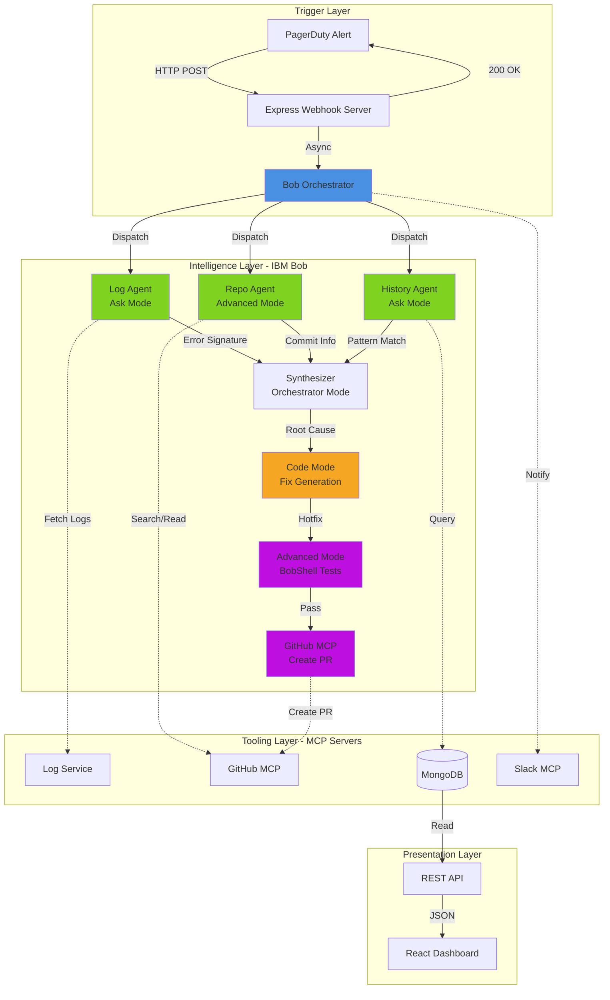

---

## Data Flow Sequence

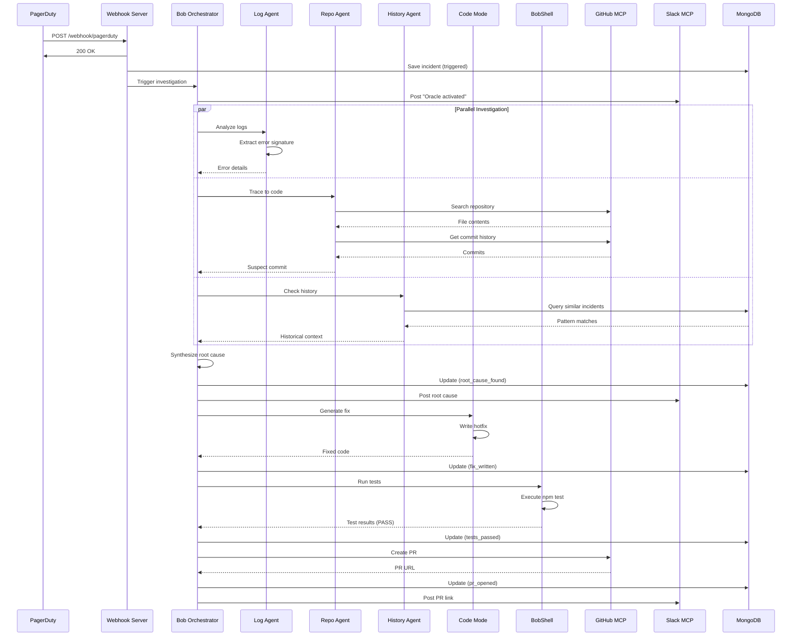

---

## Bob Mode Usage Flow

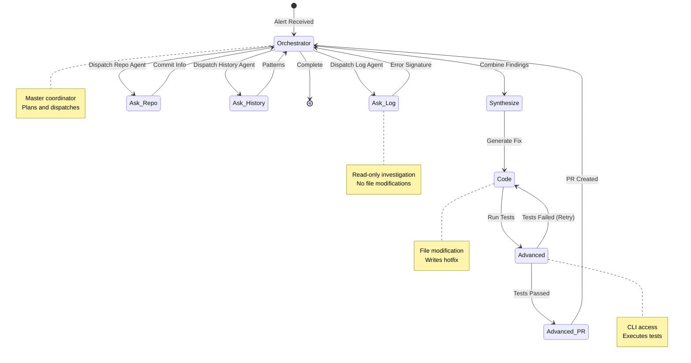

---

## Pipeline State Machine

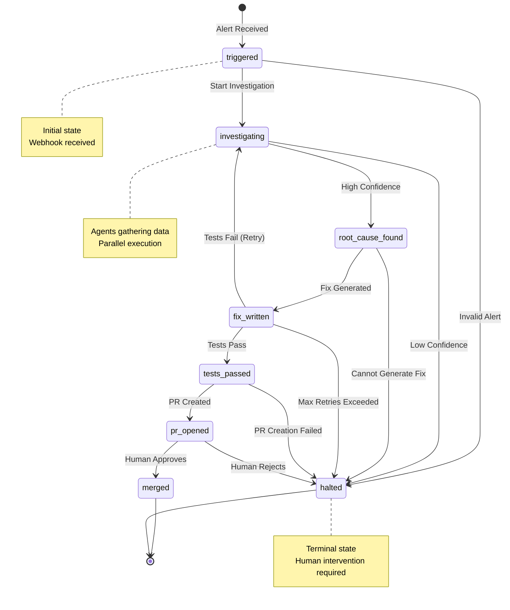

---

## Component Architecture

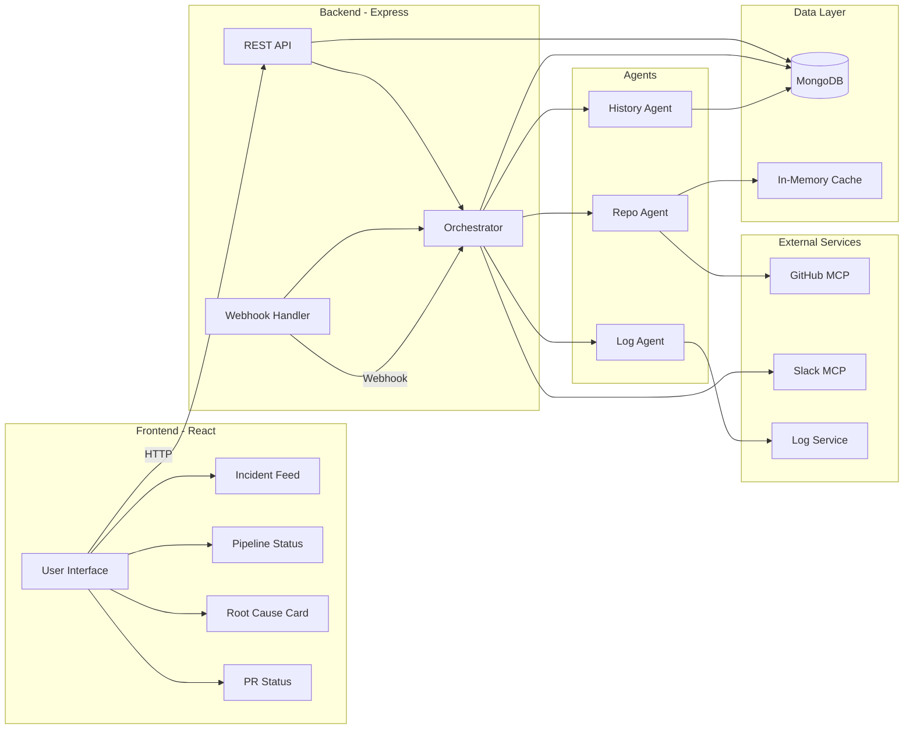

---

## Deployment Architecture

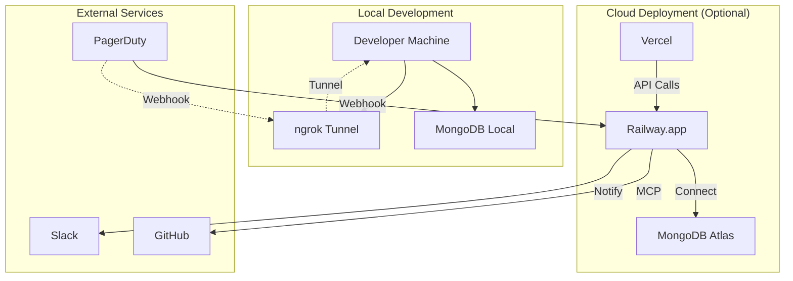

---

## MCP Integration Architecture

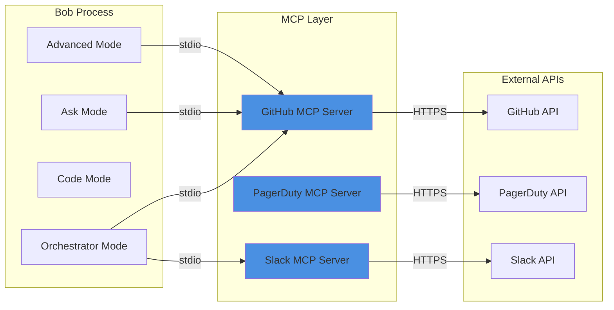

---

## Error Handling Flow

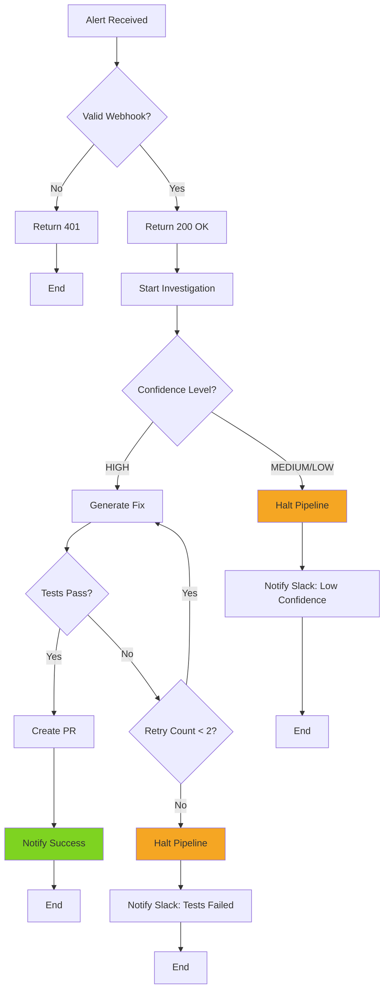

---

## Technology Stack Diagram

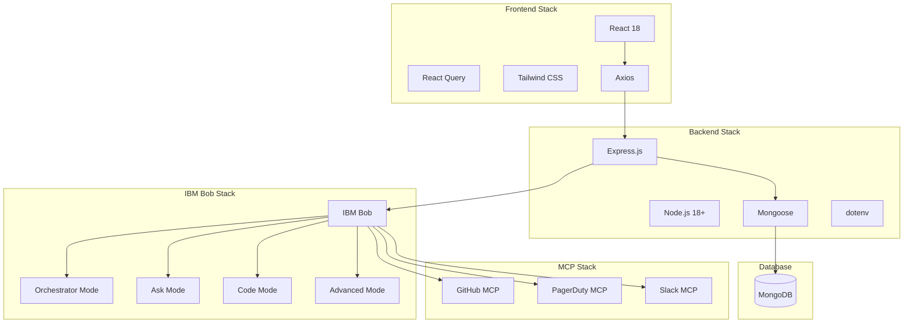

---

## Demo Flow Diagram

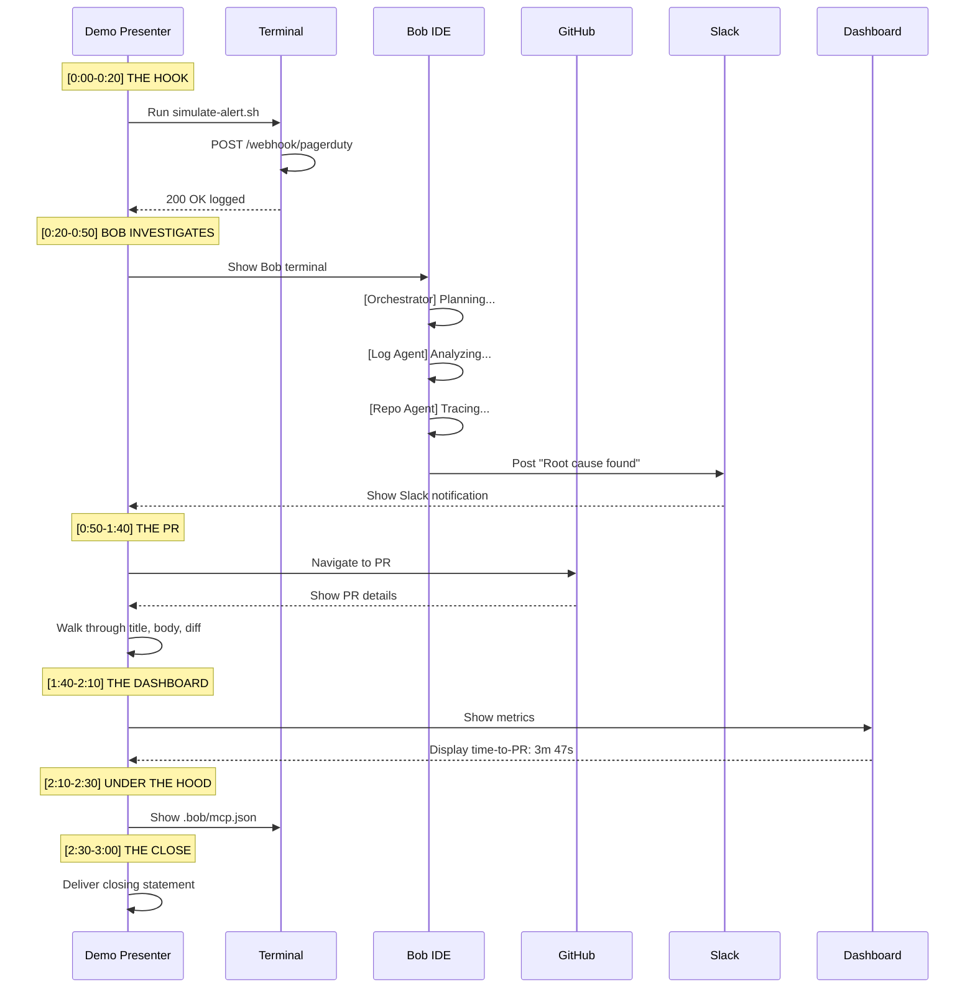

---

## Confidence Calculation Logic

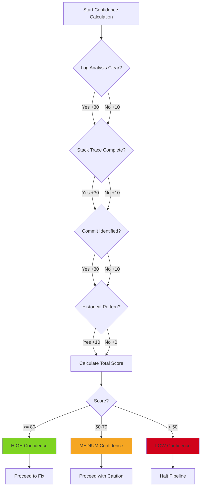

---

## Notes

### Diagram Usage

1. **System Architecture Overview** - Use in README and presentation to show high-level design
2. **Data Flow Sequence** - Use to explain the pipeline step-by-step
3. **Bob Mode Usage Flow** - Use to demonstrate proper Bob integration
4. **Pipeline State Machine** - Use to show robust state management
5. **Component Architecture** - Use for technical deep-dive with judges
6. **Deployment Architecture** - Use to show production-readiness
7. **MCP Integration Architecture** - Use to highlight MCP usage
8. **Error Handling Flow** - Use to demonstrate resilience
9. **Technology Stack Diagram** - Use in README and submission
10. **Demo Flow Diagram** - Use for demo rehearsal
11. **Confidence Calculation Logic** - Use to explain AI decision-making

### Rendering Mermaid Diagrams

**In GitHub README:**
```markdown
```mermaid
[diagram code here]
```
```

**In VS Code:**
- Install "Markdown Preview Mermaid Support" extension
- Preview markdown file

**Online:**
- Use https://mermaid.live/ to render and export as PNG/SVG

### Customization Tips

- Adjust colors to match your brand
- Add more detail for technical judges
- Simplify for business-focused judges
- Export as images for presentation slides
- Keep diagrams readable at presentation size

---

*These diagrams are designed to be clear, professional, and impressive to hackathon judges. Use them strategically in your presentation and documentation.*